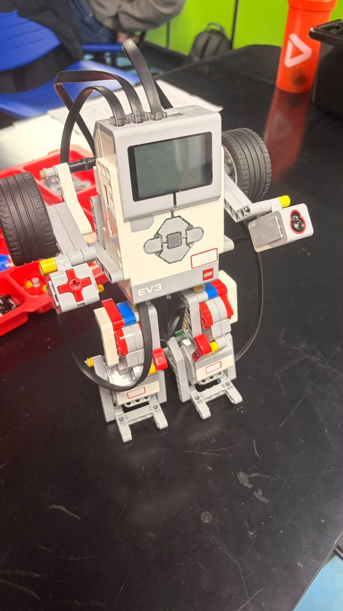

# 🤖 CHAD — Controlador Humanoide Articulado de Dança
**Equipe:**

- Cauan Lemos Souza — RA: 2402120
- Filipe Vale Moreira — RA: 2401241
- Gabriel Macedo de Araujo Vieira — RA: 2401585
- Guilherme Pinheiro dos Santos — RA: 2401832

Projeto desenvolvido para a disciplina de **Robótica**, utilizando o **LEGO Mindstorms EV3** e programação em **Python**.

O **CHAD (Coreógrafo Humanoide Articulado de Dança)** é um robô desenvolvido para executar uma coreografia automatizada, utilizando motores para movimentar suas pernas e braços, além de um sensor de toque para iniciar a apresentação.

---

## 🎯 Objetivo do Projeto

O **CHAD** foi desenvolvido para demonstrar a integração entre:

- 🤖 Robótica
- 🐍 Programação em Python
- ⚙️ Controle de motores
- 👆 Sensores
- 🔄 Estruturas de repetição
- 🧩 Organização do código em funções

Ao pressionar o sensor de toque, o robô inicia automaticamente uma sequência de movimentos, realizando uma coreografia com os braços e as pernas.

---

## 🛠️ Tecnologias e Componentes

### 💻 Software

- **Python**
- **ev3dev2**
- **LEGO Mindstorms EV3**

### 🤖 Componentes utilizados

| Componente | Porta | Função |
|---|---|---|
| Motor grande — Perna direita | B | Movimento da perna direita |
| Motor grande — Perna esquerda | C | Movimento da perna esquerda |
| Motor médio — Braços | A | Movimento dos braços |
| Sensor de toque | 1 | Iniciar a dança |

---

## ⚙️ Funcionamento

O funcionamento do CHAD pode ser resumido em quatro etapas:

```text
        ┌──────────────────────┐
        │ Inicialização do EV3 │
        └──────────┬───────────┘
                   ↓
        ┌──────────────────────┐
        │ Aguarda o sensor     │
        │ de toque             │
        └──────────┬───────────┘
                   ↓
        ┌──────────────────────┐
        │ Sensor pressionado   │
        └──────────┬───────────┘
                   ↓
        ┌──────────────────────┐
        │ Executa a coreografia│
        └──────────┬───────────┘
                   ↓
        ┌──────────────────────┐
        │ Libera os motores    │
        └──────────┬───────────┘
                   ↓
        ┌──────────────────────┐
        │ Aguarda novo toque   │
        └──────────────────────┘

```


https://github.com/GabrielMascavo75/CHAD_EV3/blob/03fc80780f3e6e731e061aada8964d5b70d346f5/assets/Inicio_da_constru%C3%A7%C3%A3o_do_prototipo.jpeg
https://github.com/GabrielMascavo75/CHAD_EV3/blob/20c390ca4be0c6aa5e8c125268c86e9f4ecc97cc/assets/Imagem_do_prototipo_construido.jpeg
## 📸 Protótipo

<p align="center">
  
</p>
<p align="center">
  
</p>
